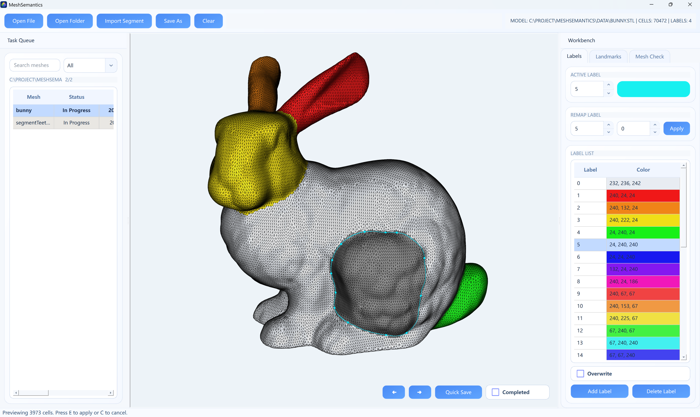
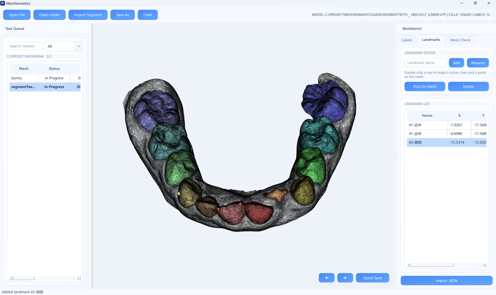
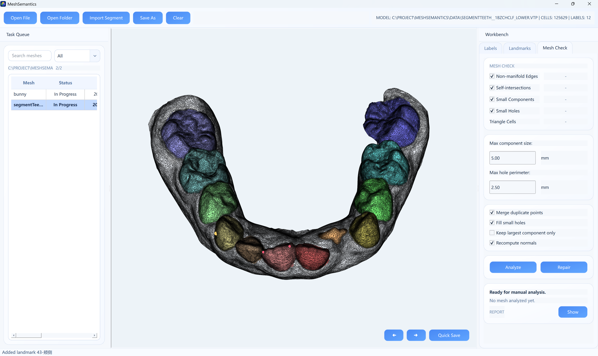

# MeshSemantics



[中文说明](./README_zh.md)

MeshSemantics is a desktop application for interactive triangle-mesh annotation and inspection. It combines semantic face labeling, landmark editing, project progress tracking, and mesh quality checking in one workflow, so you can move from raw meshes to clean, exportable annotation results without switching tools.

The app is built with `Python + PyQt6 + vedo + VTK` and is designed for practical day-to-day work on folders of `STL` and `VTP` meshes.

## Highlights

- Open a single mesh or scan a whole project folder
- View and annotate `STL` / `VTP` triangle meshes in an interactive 3D viewport
- Label faces with:
  - right-click single-face toggling
  - spline-based surface-loop selection with live preview
- Manage labels by adding, deleting, recoloring, and remapping IDs
- Support overwrite mode when assigning onto already labeled cells
- Undo and redo label edits and landmark edits
- Manage named landmarks per mesh and place them directly on the surface
- Automatically load `*.landmarks.json` next to the current mesh when available
- Run manual `Mesh Check` analysis for common topology issues
- Apply safe cleanup steps such as duplicate-point merge, small-hole fill, and small-component removal
- Export labeled meshes and metadata to `VTP`, label `JSON`, landmark `JSON`, and per-label split `STL`
- Track task states across a project folder and jump to the next unfinished model

## Screenshots

### Labeling


### Landmarks



### Mesh Check



## Main Features

### 1. Semantic Labeling

- Right click faces to add or remove them from the current selection
- Press `E` to apply the active label to the previewed selection
- Double click a labeled face to load that label into the current label selector
- Use spline mode to draw a closed surface contour directly on the mesh
- Insert and delete spline control points while refining the boundary
- Toggle overwrite mode if you want to relabel already assigned regions

### 2. Label Management

- Create new label IDs
- Delete label IDs that are no longer needed
- Edit label colors
- Remap one label ID to another
- Keep a consistent color map across sessions

### 3. Landmark Editing

- Create, rename, select, and delete named landmarks
- Click `Pick On Mesh` and place the active landmark with a surface click
- Double click the mesh in landmark mode to create a landmark at that position
- Avoid duplicate names by reusing, overwriting, or creating a copy name
- Import landmark JSON and export `*.landmarks.json`

### 4. Mesh Check And Safe Cleanup

The `Mesh Check` tab adds a lightweight mesh-inspection workflow directly inside the app.

- Manual analysis can report:
  - non-manifold edges
  - self-intersections
  - small connected components
  - small holes
  - triangle-cell count
- The report panel summarizes detected issues and affected-face counts
- Safe cleanup can optionally:
  - merge duplicate points
  - remove small components
  - fill small holes
  - keep only the largest component
  - recompute normals

If cleanup changes cell count, labels are reset and landmarks/undo history are cleared so exported data stays consistent with the repaired mesh.

### 5. Project Workflow

- Scan a folder into a task list
- Filter tasks by text and status
- Track `Unlabeled`, `In Progress`, `Completed`, and `Failed`
- Jump to previous, next, or next incomplete model
- Persist project progress so work can be resumed later
- Remove invalid entries or fall back to the original source file if a generated work file is missing

## Supported Files

### Input

- `*.stl`
- `*.vtp`

### Output

- `*.vtp` labeled mesh export
- `*.json` label-array export
- `*.landmarks.json` landmark export
- per-label `*.stl` split export

### JSON Layouts

Label JSON contains:

- `cell_count`
- `labels`

Landmark JSON contains:

- `landmark_count`
- `landmarks`
  - `name`
  - `coordinates`

Landmarks without a picked position are saved with `coordinates: null`.

## Interface Overview

- Center: interactive 3D mesh viewport
- Left panel:
  - project file list
  - search box
  - status filter
  - next-model navigation
- Right dock:
  - `Labels`
  - `Landmarks`
  - `Mesh Check`
- Top toolbar:
  - `Open File`
  - `Open Folder`
  - `Import Segment`
  - `Save As`
  - `Clear Selection`
- Floating viewport actions:
  - previous model
  - next model
  - quick save
  - completed toggle

## Shortcuts

Shortcuts depend on the active right-side panel.

### Global

| Key | Action |
| --- | --- |
| `B` | Open previous model |
| `N` | Open next model |
| `Ctrl+Z` | Undo |
| `Ctrl+Y` | Redo |

### Labels

| Key | Action |
| --- | --- |
| `Ctrl+S` | Quick save current mesh as `VTP` |
| `Ctrl+Shift+S` | Save current result as `VTP` / `JSON` / `STL` |
| `S` | Enter spline mode |
| `Enter` | Build spline preview |
| `E` | Apply current preview to the active label |
| `C` | Clear current preview |
| `M` | Toggle completed status |
| `Delete` / `Backspace` | Delete highlighted spline control point |

### Landmarks

| Key | Action |
| --- | --- |
| `Enter` | Add landmark from the current input name |
| `Ctrl+S` | Quick save landmarks as `JSON` |
| `Ctrl+Shift+S` | Export landmarks as `JSON` |
| `Delete` / `Backspace` | Delete the active landmark |

### Mesh Check

| Key | Action |
| --- | --- |
| `Ctrl+S` | Quick save current mesh as `VTP` |
| `Ctrl+Shift+S` | Save current result as `VTP` / `JSON` / `STL` |
| `R` | Run manual analysis |
| `Ctrl+R` | Run safe cleanup |

## Typical Workflow

1. Open one mesh or a project folder.
2. Pick the current task from the left panel.
3. Annotate regions in `Labels`.
4. Save intermediate results with quick save.
5. Add or import landmarks in `Landmarks`.
6. Inspect the mesh in `Mesh Check` if quality problems are suspected.
7. Export `VTP`, label `JSON`, landmark `JSON`, or split `STL` as needed.
8. Mark the task completed and move to the next model.

## Running The App

Recommended environment:

```bash
conda activate meshlabeler
python -m pip install -r requirements.txt
python main.py
```

Validated interpreter:

- Python `3.10.20`

Validated direct dependencies:

- `numpy==2.2.6`
- `PyQt6==6.11.0`
- `vedo==2026.6.1`
- `vtk==9.6.1`

## Project Structure

```text
MeshSemantics/
|-- main.py
|-- meshsemantics/
|   |-- app.py
|   |-- config/
|   |-- core/
|   |-- ui/
|   `-- assets/
|-- doc/
|-- data/
|-- README.md
`-- README_zh.md
```

## Notes

- `STL` is treated as an unlabeled mesh when loaded.
- `VTP` reuses its `Label` cell data when present.
- The app is optimized for efficient annotation and inspection workflow, not CAD-grade manual boundary editing.

## License

See [LICENSE](LICENSE).
